# Arquitectura de WishesTracer

## Índice
- [Arquitectura General](#arquitectura-general)
- [Flujo Principal de la Aplicación](#flujo-principal-de-la-aplicación)
- [Operaciones CRUD](#operaciones-crud)
- [Flujo de Monitoreo de Precios](#flujo-de-monitoreo-de-precios)
- [Manejo de Errores y Middleware](#manejo-de-errores-y-middleware)
- [Dependency Injection](#dependency-injection)
- [Patrones de Diseño](#patrones-de-diseño)

## Arquitectura General

El proyecto sigue **Clean Architecture** con separación clara de responsabilidades en capas:


### Principios de Clean Architecture

1. **Independencia de frameworks**: El dominio no depende de Entity Framework, ASP.NET, etc.
2. **Testeable**: Las reglas de negocio pueden probarse sin UI, BD o servicios externos
3. **Independencia de UI**: La UI puede cambiar sin afectar el resto del sistema
4. **Independencia de BD**: Puedes cambiar de PostgreSQL a SQL Server sin tocar el dominio
5. **Independencia de agentes externos**: Las reglas de negocio no saben de scrapers o APIs

## Flujo Principal de la Aplicación

### Inicialización de la Aplicación


## Operaciones CRUD

### Crear Producto (POST /api/products)


### Obtener Productos con Caché (GET /api/products)

```mermaid
sequenceDiagram
    participant Client
    participant Controller
    participant Mediator
    participant CacheBehavior as CachingBehavior
    participant Handler as GetProductsHandler
    participant Cache as Redis
    participant Repo as ProductRepository
    participant DB as PostgreSQL

    Client->>Controller: GET /api/products?page=1&pageSize=10
    Controller->>Mediator: Send(GetProductsQuery)
    Mediator->>CacheBehavior: Handle(query)
    
    CacheBehavior->>Cache: GetStringAsync(cacheKey)
    
    alt Cache Hit
        Cache-->>CacheBehavior: Cached data
        Note over CacheBehavior: 🚀 Cache HIT
        CacheBehavior->>CacheBehavior: Deserialize<PagedResult>
        CacheBehavior-->>Controller: Result<PagedResult>
    else Cache Miss
        Cache-->>CacheBehavior: null
        Note over CacheBehavior: 🐌 Cache MISS
        CacheBehavior->>Handler: next() - Execute handler
        Handler->>Repo: GetPagedAsync(page, pageSize)
        Repo->>DB: SELECT with pagination
        DB-->>Repo: Products
        Repo-->>Handler: (products, totalCount)
        Handler->>Handler: Map to DTOs
        Handler-->>CacheBehavior: Result<PagedResult>
        CacheBehavior->>CacheBehavior: Serialize result
        CacheBehavior->>Cache: SetStringAsync(key, data, 5min)
        Cache-->>CacheBehavior: OK
        CacheBehavior-->>Controller: Result<PagedResult>
    end
    
    Controller->>Controller: ToValueOrProblemDetails()
    Controller-->>Client: 200 OK<br/>PagedResult
```



## Flujo de Monitoreo de Precios

### Background Job de Hangfire (Ejecuta cada hora)

```mermaid
sequenceDiagram
    participant Hangfire
    participant Mediator
    participant Handler as CheckProductPricesHandler
    participant Repo as ProductRepository
    participant Scraper as ScraperService
    participant Publisher as MediatR Publisher
    participant EventHandler as PriceChangedEventHandler
    participant Cache as Redis

    Note over Hangfire: Cron.Hourly triggered
    Hangfire->>Mediator: Send(CheckProductPricesCommand)
    Mediator->>Handler: Handle(command)
    
    Handler->>Repo: GetActiveProductIdsAsync()
    Repo-->>Handler: List<Guid> activeIds
    
    loop For each product ID
        Handler->>Repo: GetByIdAsync(productId)
        Repo-->>Handler: Product
        
        alt Product is Active
            Handler->>Scraper: ScrapeProductAsync(url)
            Note over Scraper: Rate limiting +<br/>Random delay
            Scraper-->>Handler: ProductScrapedDto
            
            Handler->>Handler: previousPrice = product.CurrentPrice
            Handler->>Handler: product.UpdatePrice(newPrice, ...)
            
            Handler->>Repo: SaveChangesAsync()
            Repo-->>Handler: Success
            
            alt Price Changed
                Handler->>Publisher: Publish(PriceChangedEvent)
                Publisher->>EventHandler: Handle(event)
                EventHandler->>Cache: RemoveAsync("product-history:...")
                EventHandler->>Cache: RemoveAsync("product-details:...")
                Note over EventHandler: 🔔 Log price change<br/>alert (could send email)
                EventHandler-->>Publisher: Done
            else No Price Change
                Note over Handler: 📊 Log: no changes
            end
        else Product Inactive
            Note over Handler: ⏭️ Skip product
        end
    end
    
    Handler-->>Mediator: Task completed
```



### Invalidación de Caché en Cambios de Precio


## Manejo de Errores y Middleware

### Pipeline de Middleware


### Result Pattern y Error Handling


## Dependency Injection

### Configuración de Servicios por Lifetime


### Registro de Servicios


## Patrones de Diseño

### 1. CQRS (Command Query Responsibility Segregation)


### 2. Repository Pattern

```
IProductRepository (Domain)
        ↓ implements
ProductRepository (Infrastructure)
        ↓ uses
ApplicationDbContext (EF Core)
```

### 3. Strategy Pattern (Web Scraping)


### 4. Mediator Pattern (MediatR)


### 5. Result Pattern (Railway-Oriented Programming)


## Consideraciones de Seguridad

1. **Rate Limiting en Scraper**: Máximo 2 requests concurrentes, delays aleatorios
2. **SQL Injection**: Protegido por Entity Framework parametrizado
3. **Nullable Reference Types**: Habilitados en todos los proyectos
4. **Input Validation**: Data annotations + FluentValidation
5. **Exception Handling**: Global handler evita leaking de información sensible
6. **Connection Strings**: Nunca en código, solo en appsettings o secrets

## Escalabilidad

### Estrategias Implementadas

1. **Distributed Caching**: Redis para queries frecuentes
2. **Pagination**: Evita cargar grandes datasets en memoria
3. **Background Jobs**: Hangfire desacopla el procesamiento pesado
4. **Async/Await**: Operaciones I/O no bloqueantes
5. **Strategy Pattern**: Fácil agregar nuevos vendors sin modificar código existente

### Futuras Mejoras

- [ ] API Rate Limiting con AspNetCoreRateLimit
- [ ] Health checks con /health endpoint
- [ ] Outbox pattern para garantía de eventos
- [ ] Read replicas de PostgreSQL
- [ ] Horizontal scaling con Redis Cluster
